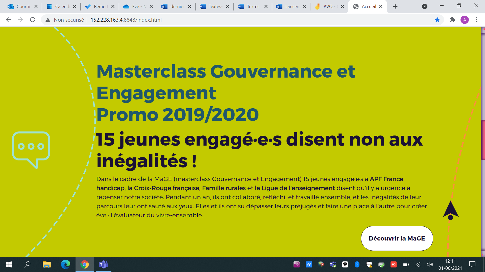
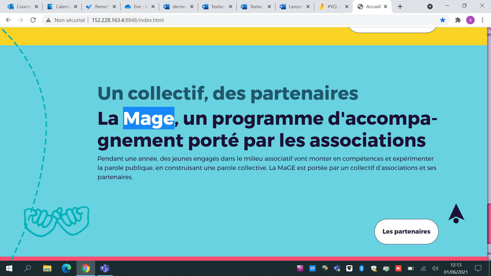
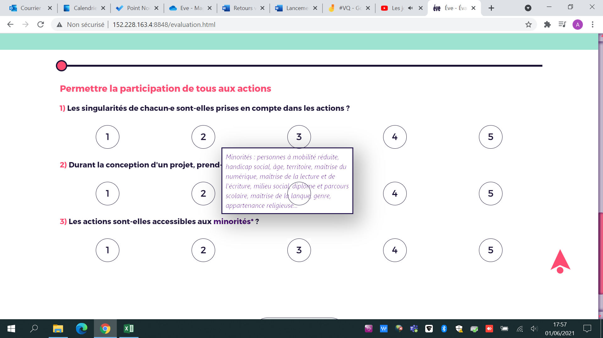
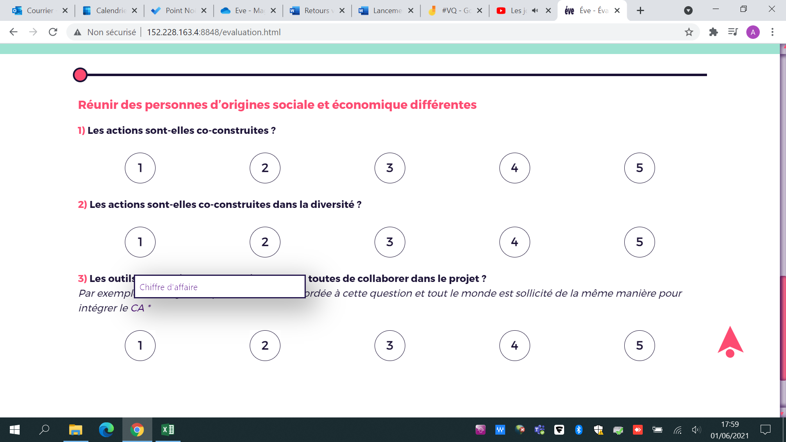
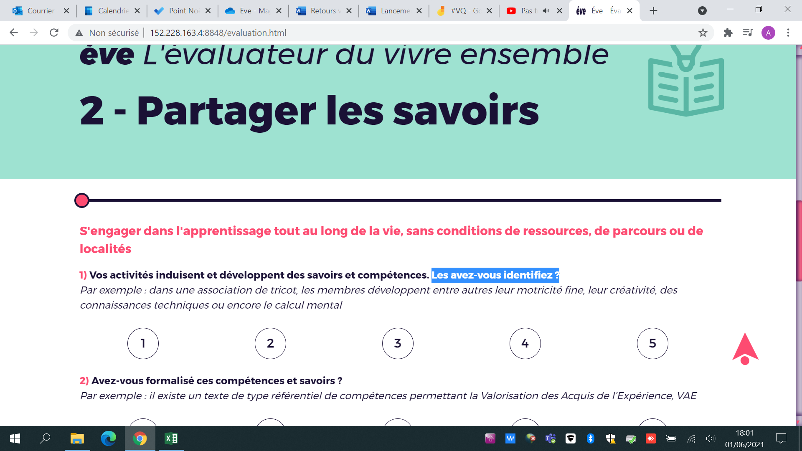
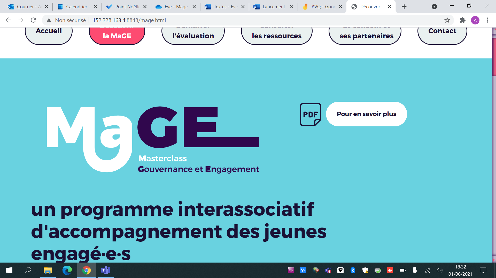

# Retours MAGE 01/06

Tout d'abord un grand bravo pour vos avancées sur le site, ça rend vraiment bien on est fan!!

Voilà de nouveaux retours sur le site : 

Pour le bandeau en haut : 

- On adore l'animation (félicitations à l'apprenant 😉)
- Il faudrait agrandir le logo de la Croix Rouge
- Est-il possible de mettre en bas du bandeau : "Un parcours créé et animé avec  :" + le logo de l'institut de l'engagement. un peu décalé à droite

Dans la partie "Le collectif et ses partenaires" : 

- Les logos Croix Rouge & AFM Téléthon ne s'affichent pas bien
- Serait-il possible de mettre en-dessous des assos du collectif : "Un parcours  créé et animé par :" puis mettre l'institut de l'engagement ? 

Sur la page d'accueil :

- Dans l'accueil : le bouton "Démarrer l'évaluation" n'est pas encore actif
- Serait-il possible de mettre Masterclass Gouvernance et Engagement sur une seule ligne ?
- Et si possible décaler sur la gauche le trait pointillé bleu ciel

Serait-il possible de noter "La MaGE" à cet endroit svp ? (c'est l'orthographe correct j'ai du oublier de le dire MaGE)

- Pour les **textes** : nous vous enverrons de nouveaux aujourd'hui ou demain
- Voilà une proposition pour le FDVA : (tout en bas de la partie "le collectif et ses partenaires"

Le Fonds de Développement de la Vie Associative (FDVA) a été créé en  2011 pour accompagner et soutenir le développement du million  d’associations que compte notre pays. Pour cela, il mobilise 2 axes  d’interventions : le soutien à la formation des bénévoles et le financement du fonctionnement ou des projets innovants.

lien : https://www.associations.gouv.fr/FDVA.html

Voilà quelques éléments que j'ai trouvés sur le questionnaire : 

Maitrise de la langue* et cercle visible dans l'étiquette

CA = Conseil d'Administration

Les avez-vous identifiés ? *

Sur la page ci-dessous : 

- Le document sur le bouton "Pour en savoir plus" n'est pas le bon. C'est celui-ci le bon : [http://jeune.apf.asso.fr/files/Pr%C3%A9sentation%20Masterclass.pdf](http://jeune.apf.asso.fr/files/Présentation Masterclass.pdf)
- Est-il possible de mettre : Un programme interassociatif d'accompagnement des  jeunes engagé.e.s - donc avec le U majuscule et si possible sur une  ligne ou deux

